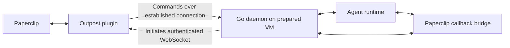

# Recovered Paperclip Outpost design

Recorded on 2026-10-06 through a design interview. This is a reconstruction from
the operator's memories and subsequent decisions, not a recovered transcript.

## Status and evidence

The repository began empty. These documents capture requirements; they do not
claim implementation or deployment acceptance.

- **Accepted** means the operator chose or accepted the behavior in the interview.
- **Finding** means upstream source was inspected; it is not an end-to-end test.
- **Proposed integration** describes a possible implementation of an accepted
  requirement. It remains subject to engineering verification.
- **Open** means the interview has not selected an implementation detail.

Upstream findings refer to Paperclip commit
[`f858207161ba29c01c82f4674aef83d91b74480f`](https://github.com/paperclipai/paperclip/tree/f858207161ba29c01c82f4674aef83d91b74480f).
The existing pi-config bridge instead records contract commit
[`59015846ae02f935411afc620e0867ce812378fb`](https://github.com/paperclipai/paperclip/tree/59015846ae02f935411afc620e0867ce812378fb).
The new integration must validate and record its actual supported versions.

## Goal and boundaries

**Accepted.** Install a persistent daemon on prepared Linux machines so agents
from an authenticated remote Paperclip instance can execute there. The daemon is
written in Go. The instance-side Paperclip plugin is written in TypeScript,
managed with pnpm, and uses Effect.

Outpost is agent agnostic. Reuse upstream adapters and the callback bridge
where possible. Necessary upstream changes are allowed, including breaking
changes when required; compatibility must be handled explicitly rather than
assuming unchanged upstream installations always work.

The first complete acceptance target is Pi with
[pi-config](https://github.com/Yelqo/pi-config), on Ubuntu. Linux is the initial
product platform. Other agent runtimes require individual validation before
compatibility is claimed.

Keep the scope narrow: no SSH, VM provisioning, toolchain provisioning,
repository synchronization, automatic placement scheduler, daemon job queue,
self-updater or Cloudflare resource management. This does not forbid necessary
run assets or transport support; those must preserve the agreed local ownership
boundaries.

## Components and execution flow

| Component | Responsibility |
| --- | --- |
| Paperclip | Tasks, scheduling, agent identity, human decisions and run history |
| Outpost plugin | Registration, execution environment integration, dispatch and reconciliation |
| Go daemon | Connection, local admission, process supervision, output and execution records |
| Agent runtime | Agent behavior and its own sandbox/tool enforcement |

**Accepted.** The daemon initiates an authenticated WebSocket connection to the
instance and reconnects when interrupted. Commands, output and run-associated
control traffic use that connection. No inbound VM listener or separate message
broker is required. The operator's planned deployment uses a named cloudflared
tunnel to the remote instance, but the product does not require Cloudflare.

The callback bridge is reused for task reads, progress and approval interaction
calls. It carries scoped run authentication; machine credentials and optional
proxy credentials are not supplied to agent runtimes for these callbacks.

## Trust, registration and connection settings

**Accepted.** Paperclip is a trusted execution controller within a dedicated,
unprivileged worker account on an isolated VM. Each runtime must retain its own
sandbox beyond that boundary. The pi-config approval gate governs Pi's actions;
it does not make a trusted controller unable to launch other programs.

The registration flow reuses Paperclip's operator browser/CLI authentication.
Registration then issues a distinct, revocable outpost credential. The daemon
retains that machine credential rather than the operator's login. Work-agent
keys are not repurposed as transport identities. Exact credential issuance,
storage and rotation mechanics remain open.

Connection settings are configured after installation and before registration,
so registration and the daemon use the same settings when the instance is behind
an additional access layer. A setup CLI is appropriate; exact command spelling
is not fixed.

**Accepted after refinement of Q23.** Compatibility with an already configured
Cloudflare Access layer means supplying its existing authentication headers.
Cloudflare is one optional connection requirement, not a product-wide assumption.
Outpost does not call Cloudflare's management API, create policies or tokens, or
ask for account-management credentials. A local setup helper may collect and
test existing connection credentials. Future connection requirements can be
added without making Cloudflare part of the core identity model.

Private connection credentials and durable execution state belong outside
agent-writable workspace and scratch roots. Existing pi-config protections must
remain intact. The precise local protection mechanism is implementation work;
filesystem ownership alone does not isolate processes sharing the worker UID.

## Target selection, workspace ownership and concurrency

**Accepted working scope.** An outpost initially belongs to one instance and one
company and may serve multiple agents. The company restriction is an initial
scope decision, not an upstream requirement. The operator accepted this
provisionally because their familiarity with Paperclip was limited; revisit it
if a real cross-company use case emerges.

The operator explicitly assigns an agent to a named outpost execution
environment. The AI agent does not pick a machine. There is no automatic pool
placement. Project configuration supplies an existing absolute workspace path
interpreted on the selected outpost; the daemon requires that directory to exist.
No independent Outpost workspace catalog is required.

**Source correction.** The interview initially described project-level target
selection based on upstream documentation. At the inspected commit, actual
selection precedence is agent environment override, instance environment
default, then local fallback, subject to managed-environment enforcement. The
resolver does not receive a project/issue target input. Do not promise
project-level machine selection without another verified upstream change.
[Selection resolver](https://github.com/paperclipai/paperclip/blob/f858207161ba29c01c82f4674aef83d91b74480f/server/src/services/execution-workspace-policy.ts),
[agent settings](https://github.com/paperclipai/paperclip/blob/f858207161ba29c01c82f4674aef83d91b74480f/ui/src/components/AgentConfigForm.tsx).

**Accepted.** Repositories, files and Git history remain authoritative on the VM
between runs. Provider credentials and runtime logins are locally managed by
default. Server-supplied credentials require explicit configuration rather than
silently replacing the machine's login. Paperclip still supplies task and run
context and its own scoped callback authentication.

One active agent run is allowed per actual workspace. Different workspaces may
run concurrently. Bridge and control operations must remain available while an
agent runs; an execution limit must not block its own callbacks. The operator
personally intends to assign one agent to each outpost. This is a deployment
preference, not a product default or a claim of stronger machine-wide exclusion.

## Scheduling, interruption and recovery

**Accepted.** Paperclip retains pending work and owns retry scheduling. A busy or
offline outpost reports availability; it does not hold its own job queue. The
daemon also enforces workspace exclusion locally, because server records alone
cannot prove that a previous process has ended.

| Event | Required behavior |
| --- | --- |
| Assigned target offline or workspace occupied before launch | Work remains pending in Paperclip; its scheduler retries |
| Connection lost during a run | Existing work may continue within its original limits; buffer output locally |
| Human approval cannot be reached | Approval-dependent operations remain blocked |
| Reconnection | Reconcile existing identities, state and buffered output; never launch a duplicate |
| Previous process outcome uncertain | Keep conflicting dispatch blocked until reconciliation proves termination |
| Cancellation during disconnection | Do not claim confirmed termination without evidence from the machine |
| VM reboot during a run | Restart daemon, reconnect and report interruption; do not repeat the run |
| Output buffer limit reached | Terminate and report an output-limit failure; preserve terminal record and workspace |
| Ordinary upgrade | Stop accepting new runs, drain existing runs, then upgrade and restart |
| Explicit forced stop | Record interrupted work; do not automatically replay it |

Stable run and operation identities and durable local execution history are
required for duplicate-launch rejection. Retrying delivery or reconnecting is
not permission to repeat a launched operation. Reporting interruption does not
prevent Paperclip from explicitly scheduling a distinct continuation attempt.
That continuation must not silently rerun a consumed pi-config approval.

Run state, deadlines, acknowledgement/reconciliation rules, output limits and
retention need an implementation specification. No numeric limits, journal
format or storage engine were selected in this interview. Do not assume that
restoring an old VM snapshot preserves execution or approval consumption history.

## Distribution and lifecycle

**Accepted.** Provide a versioned global npm installation as the convenience
path, optional npx management commands, and standalone Go binaries. The npm
entry point can package or launch a precompiled Go binary; a Go compiler is not a
worker prerequisite. Exact package names and packaging mechanics remain open.

The systemd service runs a durable installed Go binary under the worker account.
It starts after reboot and reconnects without an interactive login. It must
never reference an ephemeral npx cache binary. Whether the installation uses a
system service or a user service with linger remains open.

Installation and updates are operator managed. Installing a chosen release is
an explicit action; service startup does not resolve or download a moving latest
release. There is no custom self-updater. Ordinary upgrades drain active runs
before replacement and restart.

Global npm installation and npx invocation can use the same management package,
but have different durable-path implications.
[npm installation layout](https://docs.npmjs.com/cli/v11/configuring-npm/folders/),
[npm execution](https://docs.npmjs.com/cli/v11/commands/npm-exec/).

## Upstream findings and proposed integration work

### Execution driver and runtime preparation

**Finding.** Custom environment-provider plugins supply command execution,
stdout/stderr streaming, leases and optional duplex/file operations. The current
host uses the sandbox-provider transport for these providers; the separate
`plugin` driver is marked unsupported in the published adapter/environment
support matrix. Eligible runtime adapters are listed in the
source support matrix; agent agnostic does not mean every adapter already works.
[SDK](https://docs.paperclip.ing/reference/plugins/sdk/),
[support matrix](https://github.com/paperclipai/paperclip/blob/f858207161ba29c01c82f4674aef83d91b74480f/packages/shared/src/environment-support.ts).

Pi currently prepares/restores a host-side workspace and stages runtime assets
on sandbox targets. It does not honor an in-place workspace realization. Codex
does honor in-place realization, but still stages managed runtime assets,
including authentication/configuration. Neither fact supports a blanket claim
that unchanged adapters preserve VM-owned repositories and credentials.
[Pi adapter](https://github.com/paperclipai/paperclip/blob/f858207161ba29c01c82f4674aef83d91b74480f/packages/adapters/pi-local/src/server/execute.ts),
[Codex adapter](https://github.com/paperclipai/paperclip/blob/f858207161ba29c01c82f4674aef83d91b74480f/packages/adapters/codex-local/src/server/execute.ts).

**Proposed integration.** Extend the existing realization/runtime preparation
seams to execute in an existing VM directory and preserve locally managed
runtime assets. Do not silently discard staging requests or rewrite commands to
fake adapter compatibility. Outpost must not install a runtime behind the
operator's back merely because upstream preparation assumes managed sandboxes.

### Machine authentication and connection endpoint

**Finding.** Board tokens inherit the user's authority; agent keys identify a
specific Paperclip agent. No native machine principal was found. A board token's
company argument is not an endpoint or company confinement mechanism at the
inspected commit.
[Board authentication](https://github.com/paperclipai/paperclip/blob/f858207161ba29c01c82f4674aef83d91b74480f/server/src/services/board-auth.ts),
[authentication middleware](https://github.com/paperclipai/paperclip/blob/f858207161ba29c01c82f4674aef83d91b74480f/server/src/middleware/auth.ts).

Plugin JSON HTTP routes and SSE streams do not currently expose a
machine-authenticated duplex WebSocket. A plugin cannot reliably add an
independent upgrade listener because core handles and rejects unmatched upgrade
paths.
[Plugin routes](https://github.com/paperclipai/paperclip/blob/f858207161ba29c01c82f4674aef83d91b74480f/server/src/routes/plugins.ts),
[upgrade handling](https://github.com/paperclipai/paperclip/blob/f858207161ba29c01c82f4674aef83d91b74480f/server/src/realtime/live-events-ws.ts).

**Proposed integration.** Add a declared, capability-gated plugin stream route
under Paperclip's existing origin. Core owns upgrade routing, bounded frame/RPC
delivery and lifecycle; the plugin authenticates the outpost credential and
binds the connection to its registered company/machine. Registration remains an
operator-authenticated action. The machine identity must authorize only its
transport, not board administration or work-agent API access.

### Execution identity and availability

**Finding.** Acquire parameters include run and agent identities. Execute
parameters lack explicit run/operation identities and operation purpose; duplex
open also lacks a run identity. Reusable leases and command/environment
inspection cannot safely identify which request launches an agent.
[Plugin protocol](https://github.com/paperclipai/paperclip/blob/f858207161ba29c01c82f4674aef83d91b74480f/packages/plugins/sdk/src/protocol.ts).

Paperclip has per-agent concurrency and workspace-contention retry machinery,
but its workspace gate is not keyed by canonical outpost/directory identity.
Plugin errors do not automatically enter its workspace-busy deferral path.
[Scheduling and deferral](https://github.com/paperclipai/paperclip/blob/f858207161ba29c01c82f4674aef83d91b74480f/server/src/services/heartbeat.ts).

**Proposed integration.** Carry host-authored run identity, stable operation
identity and explicit agent/control purpose through execution interfaces. Add
pre-dispatch busy/offline deferral and authoritative workspace admission while
reusing Paperclip's scheduler. Make disconnection/reconciliation recoverable at
the host layer; daemon buffering alone cannot prevent current channel/RPC
failures from terminating the host's run state.

### Pi approvals through the callback bridge

**Finding.** The inspected bridge permits all routes currently used by
pi-config: agent identity, task reads/updates, interaction listing/creation/
withdrawal and progress comments. The human-only custom-target interaction and
wake-assignee contract remains present. No allowlist patch is needed for these
routes at this commit.
[Bridge allowlist](https://github.com/paperclipai/paperclip/blob/f858207161ba29c01c82f4674aef83d91b74480f/packages/adapter-utils/src/sandbox-callback-bridge.ts),
[interaction schema](https://github.com/paperclipai/paperclip/blob/f858207161ba29c01c82f4674aef83d91b74480f/packages/shared/src/validators/issue.ts).

Remote Pi preparation replaces the API URL with a dynamic loopback bridge and
the API key with a bridge token. The current pi-config client requires its
protected static origin to equal the injected API URL, so it rejects this
arrangement.
[Bridge integration](https://github.com/paperclipai/paperclip/blob/f858207161ba29c01c82f4674aef83d91b74480f/packages/adapter-utils/src/execution-target.ts),
[pi-config client](https://github.com/Yelqo/pi-config/blob/main/src/paperclip.ts).

**Proposed integration.** Preserve the configured instance identity and introduce
a trusted per-run transport descriptor bound to the instance, company, agent,
task and run. A trusted launcher may materialize it privately before Pi starts.
Do not treat arbitrary environment-provided loopback URLs as equivalent to the
configured server, loosen scope revalidation, or erase approval consumption
records. The descriptor's format and validation remain open.

## Acceptance scenarios

The first rollout must prove these behaviors on a real Ubuntu worker and
authenticated Paperclip instance, not only mocked transport:

1. Register an outpost, select its environment for an agent and execute Pi with
   the configured existing VM workspace, credentials and approval extension.
2. Verify routine sandbox work, a human-only approval request, acceptance/denial,
   continuation and session reuse. Confirm approval routes traverse the bridge
   without giving Pi the machine or optional proxy credentials.
3. Verify the same setup through an already configured named Cloudflare tunnel
   and Access service token. Also verify ordinary authenticated WSS without
   Cloudflare or extra headers. Never log credential values.
4. Two agents targeting the same actual workspace cannot run concurrently even
   if their Paperclip workspace records differ. Control/bridge operations remain
   responsive. Different workspaces can execute concurrently.
5. Before-launch offline/busy work remains pending server-side. Connection loss
   during a run preserves its identity, local supervision and bounded buffering;
   reconnect delivers state/output without launching again.
6. Cancellation while connected confirms process termination. Cancellation
   while disconnected cannot falsely report confirmed termination or permit
   conflicting work; reconciliation resolves it.
7. Reboot during a run restarts the daemon and reports interruption without
   automatically launching the old attempt. Duplicate execution deliveries are
   rejected, including around crashes at the launch/record boundary.
8. Buffer exhaustion terminates the run, preserves its terminal record and
   reports failure without output truncation masquerading as success.
9. An ordinary upgrade drains active work; a forced stop records interruption.
   Restart uses the selected durable binary and does not fetch a new release.
10. Revoke an outpost credential and verify rejection of subsequent connections
    without granting board or unrelated agent authority. Protocol/version
    incompatibility must be detected before work is accepted.

Fixture tests should cover these invariants without paid providers or real
external mutations. Live acceptance then verifies actual adapter preparation,
runtime paths, scoped credentials, restart and company/run attribution.

## Interview decision ledger

| Question | Outcome |
| --- | --- |
| Q1 | Reuse runtime adapters wherever possible |
| Q2 | Trusted controller within dedicated unprivileged worker account; preserve runtime sandboxes |
| Q3 | Installed on prepared machines; no environment provisioning |
| Q4 | Multiple agents; one instance/company initially, provisionally accepted |
| Q5 | Linux first; Ubuntu acceptance target |
| Q6 / Q13 | Existing operator authentication for registration; separate outpost credential |
| Q7 | VM-owned provider credentials by default |
| Q8 / Q17 | Existing VM-owned workspaces; paths configured in Paperclip |
| Q9 | Continue bounded existing work during outages; buffer and reconcile |
| Q10 | Explicit operator machine assignment |
| Q11 | One active run/workspace; one agent/outpost is a personal preference |
| Q12 | Daemon returns after reboot and reports interruption; no automatic replay |
| Q14 | Upstream changes allowed, including breaking changes when necessary |
| Q15 | Pi plus pi-config is the first complete acceptance target |
| Q16 | Outbound authenticated WebSocket; no broker or inbound VM listener |
| Q18 / Q19 | Operator updates; global npm convenience path, npx management, standalone Go binary |
| Q20 | Pending work and retries belong to Paperclip |
| Q21 | Reuse callback bridge |
| Q22 | Drain for ordinary upgrades; record interruption for explicit forced stop |
| Q23 / Q25 | Optional compatibility with existing Access layer; no Cloudflare API/resource machinery |
| Q24 | Buffer exhaustion terminates the run; preserve terminal record |

## Remaining implementation decisions

The product direction is recorded, but this is not a decision-complete wire or
implementation specification. Before implementation, settle the minimal
protocol and compatibility handshake, durable journal and crash boundaries,
credential lifecycle, bridge transport descriptor, timeout/buffer/retention
values, service installation form, package names and supported release pins.
Keep these decisions proportional to the first Pi deployment. Record new
agreements as the interview continues rather than inferring answers from silence.
